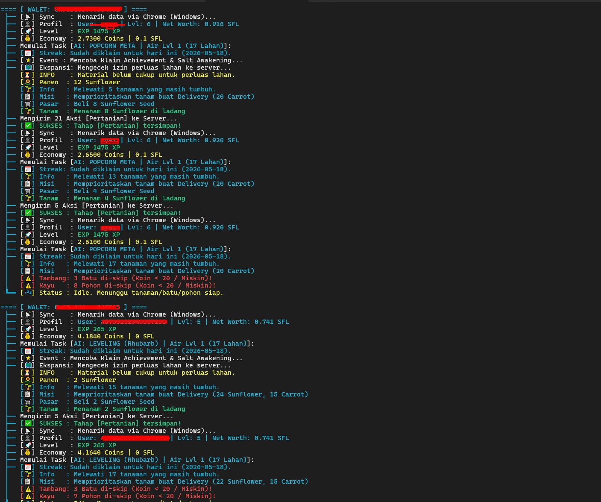

# 🌻 Sunflower Land Auto Bot

Dokumen ini menyajikan gambaran umum mengenai **Sunflower Land Auto Bot**, sebuah solusi otomatisasi yang dirancang untuk mengoptimalkan pengelolaan pertanian virtual Anda di Sunflower Land. Bot ini dikembangkan untuk meningkatkan efisiensi operasional dan memaksimalkan progres dalam permainan melalui serangkaian fitur cerdas dan terotomatisasi.

---

## ✨ Core Automation

### 🌾 Smart Farming
- Auto harvest & plant dengan prioritas berdasarkan misi delivery aktif
- Lock system: crop tidak dijual jika dibutuhkan untuk misi, masak, atau composter
- Adaptive planting: memilih bibit terbaik berdasarkan stok & kebutuhan
- Batch processing untuk hindari request spam

### 🛒 Seed Management
- Auto beli bibit saat stok dibawah threshold
- Prioritas pembelian mengikuti misi yang sedang aktif
- Shipment restock gratis saat stok server habis

### 🍳 Kitchen Automation
- Auto masak resep yang dibutuhkan misi (prioritas) atau XP
- Auto collect hasil masakan & feed bumpkin
- Bahan masak tidak diambil jika sedang di-lock untuk misi

### 🧫 Composter
- Auto build, start, collect, dan speed up (gems opsional)
- Collect + start dalam 1 autosave cycle
- Level 7+ requirement

---

## 🏆 Claim & Rewards

### ⭐ Skills & Achievements
- Auto klaim 32+ skill tier 1 & 50+ achievement
- **Session persistence**: menyimpan daftar skill/achievement yang sudah dicoba ke `token.json`
- Tidak klaim ulang tiap restart (reset tiap 24 jam)

### 📦 Other Claims
- Daily reward, chore board, airdrop, reward box, mushroom, salt awakening

---

## 🏗️ Building & Upgrade

### 🚰 Water Well
- Auto build Lv1 & upgrade ke Lv2 (Lv5) / Lv3 (Lv11)
- Koordinat cerdas: 7 alternatif jika koordinat bentrok
- Auto speed up setelah upgrade

### 🔧 Tools Craft
- Auto craft Axe, Pickaxe, Rod (fishing)
- Petting Hand & Salt Rake hanya di-craft saat Level 7+
- Cooldown 5 menit antar craft

### 🎣 Fishing
- Auto cast (Earthworm) + reel dengan jeda
- Leftover reel detection (tarik kail terlantar)
- Rod auto-craft jika belum punya

### ⚒️ Gathering
- Auto chop wood & mine stone sesuai threshold
- Threshold adaptif berdasarkan Water Well level

---

## 📦 Delivery & Trading

### 🚚 Auto Delivery
- Kirim pesanan saat semua item tersedia
- Skip Blacksmith otomatis jika level < 7
- Tracking completed orders

### 💰 Smart Selling
- Jual kelebihan crop dengan kalkulasi: stok - misi - masak - composter - buffer
- Buffer minimal 5 unit per crop

---

## ⚙️ Technical

### 🔐 Session Management
- Multi-wallet via `sunflower.txt` + `sessions/token.json`
- Token expired detection (401) → auto prompt input token baru
- Time sync dengan server via Date header

### 🔄 Resync
- Auto resync maks 3x jika state berubah setelah autosave

### 🛡️ Headers
- Rotasi User-Agent per wallet
- `curl_cffi` (TLS fingerprint) support dengan fallback ke standard `requests`

---

## 🌱 Supported

**Crops:** Sunflower, Rhubarb, Carrot, Cabbage, Soybean, Corn, Wheat, Kale + 15 lainnya

**Recipes:** Reindeer Carrot, Bumpkin Broth, Rhubarb Tart, Mashed Potato, Pumpkin Soup

**Buildings:** Water Well, Fire Pit, Compost Bin, Basic Scarecrow

---

## Akuisisi Produk:

Untuk informasi lebih lanjut mengenai **Sunflower Land Auto Bot** dan proses akuisisi, silakan kunjungi tautan produk kami di Shopee:

👉 <a href="https://shopee.co.id/product/1226220068/56210728348/" target="_blank" rel="noopener noreferrer"><strong>Link Produk di Shopee</strong></a>

Kami berkomitmen untuk menyediakan solusi yang efisien dan andal untuk pengalaman bermain Sunflower Land Anda. Terima kasih atas perhatian Anda.
